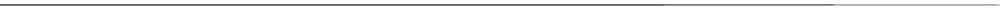

# Katanawka project

###

I'm Vadim — an 18-year-old developer passionate about building modern web and mobile applications.
I specialize in developing websites using React and TypeScript.

## 🧑‍💻 Languages:

  
  
  
  
  
  
  
  
  

## 💻 IDE & Editors:

  
  
  
  

## ⚙️ Tools & Others:

  
  
  

